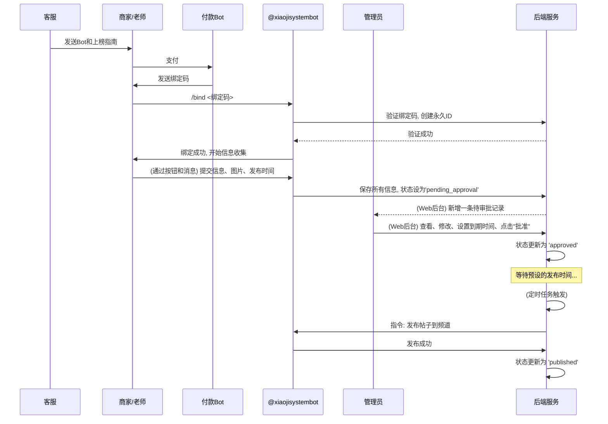

# Telegram Bot项目 - 综合分析主文档 (V2.0)

## 文档概览

本文档是对新版Telegram商户机器人系统的全面分析，旨在为开发提供一个清晰、统一的蓝图。本文档整合了重构后的业务流程、核心架构、数据库设计和功能模块规划。

**生成时间**: 2025-09-10
**项目版本**: 2.0 (基于新业务流程)
**文档状态**: 草案

---

## 项目总体概览

### 系统定位

一个为商家/老师（统称为“商户”）提供自动化帖子发布和管理的Telegram机器人平台。系统通过自动化的信息收集、标准化的内容模板和强大的后台管理，帮助商户高效地在指定频道进行推广。

### 核心价值主张

1.  **永久身份体系**: 商户拥有一个永久的平台ID，即使更换Telegram账号，其业务信息和评价（未来功能）也能得到保留和继承。
2.  **自动化上榜**: 通过机器人引导，商户可自助完成信息提交、媒体上传和发布时间设定，流程高度自动化。
3.  **管理员审核流程**: 所有待发布内容均需经过管理员审核批准，确保发布内容的质量和合规性。
4.  **定时发布与生命周期管理**: 系统根据商户设定的时间自动发布帖子，并由管理员控制帖子的有效期限。
5.  **一体化管理**: 强大的Web后台为管理员提供对商户、帖子、绑定码的全方位管理能力。

### 技术创新点

- **永久ID与TG账号解耦**: 核心业务数据与易变的Telegram账号分离，增强系统健壮性。
- **状态驱动的自动化流程**: 通过`status`字段驱动帖子从创建、审批到发布、过期的完整生命周期。
- **定时任务服务**: 独立的后端服务负责内容的定时、精准发布。
- **模板化内容生成**: 保证所有发布内容的风格统一，同时动态填充商户数据。

---

## 用户角色与核心业务流程

### 主要用户角色

#### 1. 商户用户 (商家/老师)
**角色定位**: 希望在平台上发布推广信息的内容提供者。

**核心流程**:
`获取绑定码 -> Bot内自动绑定 -> 填写资料 -> 等待审批 -> 成功发布`

**主要交互**:
- 从客服处获取支付机器人链接，支付后获得绑定码。
- 使用 `/bind <绑定码>` 命令与主机器人绑定，创建永久ID。
- 通过机器人引导，提交名称、联系方式、地区、价格、优缺点、技能介绍等信息。
- 上传6张图片或视频作为宣传材料。
- 选择期望的帖子发布时间。
- 通过 `/panel` 命令查看自己的帖子状态和到期时间。

#### 2. 系统管理员
**角色定位**: 系统的维护者和内容审核者，通过Web管理后台进行操作。

**核心流程**:
`生成绑定码 -> 审核商户提交内容 -> 修改/确认 -> 批准发布 -> 管理帖子到期时间`

**主要职责**:
- 在Web后台批量生成绑定码，并提供给客服。
- 审核“待审批”状态的商户信息，检查内容合规性。
- 可修改商户提交的任何信息。
- 为帖子设置到期时间（默认为30天）。
- 点击“批准发布”，将帖子置为“待发布”状态。
- 查看系统整体运营数据。

### 核心业务流程分析 (Mermaid图)

---

## 数据库架构分析

为支撑V2.0的完整业务，数据库包含以下核心表：

- **商户与内容**: `merchants`, `media`, `binding_codes`
- **地理位置**: `cities`, `districts`
- **订单与评价**: `orders`, `reviews`, `merchant_scores`
- **用户与激励**: `users`, `user_levels`, `badges`, `user_badges`, `badge_triggers`

（详细表结构定义请参见各模块文档）

---

## Web管理后台功能解析

### 1. 仪表板
- **核心指标**: 待审批帖子数、已发布帖子数、活跃商户总数。
- **快速入口**: 快速跳转到待审批列表。

### 2. 商户与帖子管理
- **统一列表**: 展示所有商户及其帖子的核心信息（永久ID, 名称, 状态, 发布时间, 到期时间）。
- **状态筛选**: 可按 `pending_approval`, `approved`, `published`, `expired` 等状态筛选列表。
- **详情与编辑**:
    - 查看商户提交的所有文本和媒体信息。
    - **管理员可修改所有字段**。
    - **设置到期时间**: 管理员可手动设定或修改帖子的`expiration_time`。
- **核心操作**:
    - **批准发布**: 将帖子状态从 `pending_approval` 切换到 `approved`。这是帖子能否被自动发布的关键。
    - **删除**: 删除商户及其所有关联数据。

### 3. 绑定码管理
- **批量生成**: 管理员可一次性生成多个绑定码。
- **状态跟踪**: 清晰地看到每个码的使用状态（未使用, 已使用, 使用者ID）。
- **管理操作**: 复制、删除、清理过期码。

### 4. 后端服务
- **定时调度服务 (Scheduler Service)**:
    - 这是一个基于 `APScheduler` 的独立后台 `worker` 进程，负责处理所有时间驱动的任务。
    - **精确发布任务**: 根据商户设定的 `publish_time`（例如 9:00, 12:00），调度器会**在精确的时间点**触发任务。该任务会查找所有 `status = 'approved'` 且发布时间已到的帖子，生成内容并发布到指定频道，然后将帖子的状态更新为 `published`。
    - **服务到期处理任务**: 调度器会每日（例如在凌晨）执行一个检查任务。该任务会查找所有 `status = 'published'` 且 `expiration_time`（服务到期时间）已过的帖子。对于这些帖子，系统会触发一个**后续处理流程**（例如，自动从频道删除帖子、标记为服务暂停等，具体行为待定），并可能更新其状态以反映服务已到期。

---

## 总结与展望

V2.0架构通过引入**永久ID**和**状态驱动**的流程，极大地提升了系统的健壮性和可管理性。新的业务流程清晰地划分了商户、管理员和自动化服务的职责，为未来的功能扩展（如评价系统、推广活动）打下了坚实的基础。

这是一个高度模块化、自动化和可控的系统设计，能够精准满足预期的业务目标。
