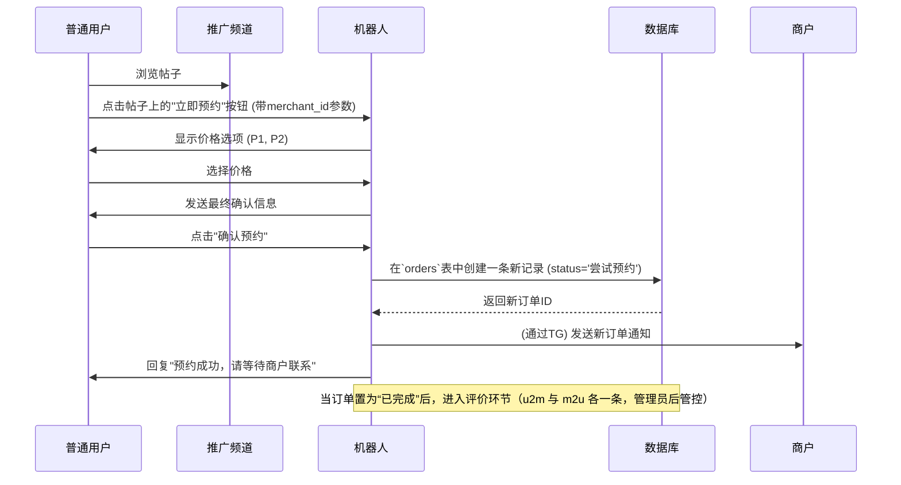

# 订单管理和处理模块技术文档 (V2.0)

## 🚨 订单-商户关联标准 (引用绑定码模块)

### 订单创建时商户ID使用
```python
# ✅ 订单中商户ID的标准使用
order_data = {
    'merchant_id': merchant_id,  # 商户永久ID，来自merchants.id
    'customer_user_id': customer_telegram_id,  # 客户TG ID
    'customer_username': customer_username,
    'price': price,
    'status': '尝试预约'
}

# 通过商户永久ID查询订单
from database.db_orders import orders_manager
orders = await orders_manager.get_orders_by_merchant(merchant_id)
```

### 商户身份验证集成
```python
# 订单操作权限验证 (引用01-身份验证模块)
from database.db_merchants import merchants_manager

async def verify_merchant_order_access(telegram_id, order_id):
    """验证商户是否有权限操作订单"""
    merchant = await merchants_manager.get_merchant_by_telegram_id(telegram_id)
    if not merchant:
        return False
    
    order = await orders_manager.get_order_by_id(order_id)
    return order and order['merchant_id'] == merchant['id']
```

---

## 模块概述

订单管理和处理模块是系统的核心业务组件之一，负责处理普通用户在看到商户推广帖子后，进行服务预约的完整流程。本模块不仅记录了交易的关键信息，还为未来的**评价系统**奠定了基础。

### 业务价值
- 记录用户与商户之间的每一次服务预约。
- 提供清晰的订单状态跟踪（待处理、已确认、已完成、已取消）。
- 保存完整的预约记录，包括价格、时间等，方便后续追溯。
- **前瞻性设计**: 包含“评价状态”字段，为后续的商户评价系统提供数据支持。

---

## 数据库设计

### `orders` 表结构
这是订单模块唯一的核心数据表，记录了所有预约的详细信息。

```sql
CREATE TABLE orders (
    id INTEGER PRIMARY KEY AUTOINCREMENT,          -- 订单唯一ID
    merchant_id INTEGER NOT NULL,                  -- 关联的商户永久ID (FK to merchants.id)
    customer_user_id BIGINT NOT NULL,              -- 预约用户的Telegram ID
    customer_username TEXT,                        -- 预约用户的TG用户名 (@handle)
    price INTEGER NOT NULL,                        -- 订单价格
    appointment_time DATETIME,                     -- 预约的服务时间
    completion_time DATETIME,                      -- 订单完成时间
    status TEXT NOT NULL DEFAULT '尝试预约' CHECK (status IN ('尝试预约', '已完成', '已评价', '双方评价', '单方评价')), -- V2.0五阶段订单状态
    created_at DATETIME DEFAULT CURRENT_TIMESTAMP, -- 订单创建时间
    updated_at DATETIME DEFAULT CURRENT_TIMESTAMP, -- 订单更新时间
    FOREIGN KEY (merchant_id) REFERENCES merchants(id) ON DELETE CASCADE
);
```

--- 

## 核心业务逻辑

### 1. 订单创建流程
当用户点击商户帖子中的“立即预约”按钮后，机器人将触发此流程。

```python
# 伪代码逻辑
async def create_order_process(user_id, merchant_id, price):
    # 1. 与用户确认预约信息
    confirmation = await ask_user_for_confirmation(user_id, merchant_id, price)
    if not confirmation:
        return # 用户取消

    # 2. 收集必要信息
    user_info = await bot.get_chat(user_id)

    # 3. 准备订单数据
    order_data = {
        'merchant_id': merchant_id,
        'customer_user_id': user_id,
        'customer_username': user_info.username,
        'price': price,
        'status': '尝试预约' # V2.0初始状态
    }

    # 4. 在数据库中创建订单
    order_id = await db.orders.create(order_data)

    # 5. 通知商户
    await notify_merchant_of_new_order(merchant_id, order_id, user_info)

    # 6. 回复用户
    await message.answer(f"预约成功！您的订单ID为 {order_id}。请等待商户与您联系确认。")
```

### 2. 订单状态管理
订单的状态由商户或管理员在 Web 后台进行更新，以反映预约的实际进展。推荐状态包括：`尝试预约`、`已完成`。当订单标记为“已完成”后，进入评价环节（不引入邀请/催评/评价过期等流程）。

---

## 业务流程详解（含评价起点）

### 用户预约流程图



---

## Web管理后台集成

订单数据是Web后台的核心管理内容之一。

- **订单列表**: 管理员可以在后台查看所有订单的列表，列表页会展示订单ID、关联商户、预约用户、价格、状态和创建时间等关键信息。
- **高级筛选**: 管理员可以根据**商户**、**订单状态**或**日期范围**对订单进行筛选和查询，方便地进行业务统计和问题排查。
- **订单详情**: 点击单个订单可以查看所有详细信息，包括各项时间戳和评价状态。
- **状态管理**: （可选功能）可以允许管理员在后台手动修改订单状态。
